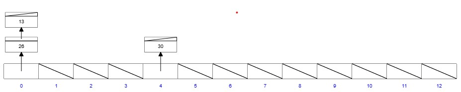
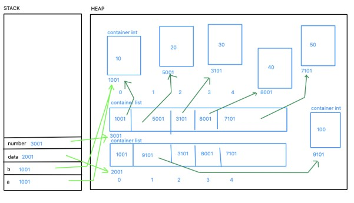
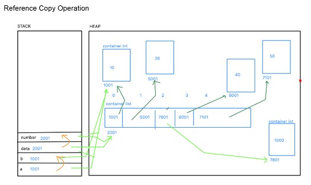

# Day 3 Notes

# 1. Hashing

Hashing is a technique used to convert data into a fixed-size integer called a Hash Code.

Hash Function

hash(x) = x % n

where

x = data
n = number of buckets

Example

Number = 26

Buckets = 13

Hash

26 % 13 = 0

Store data inside Bucket 0.

---

# Hashing of Strings

Python internally computes hash values for strings.

Example

"Apple"

↓

hash("Apple")

↓

Large Integer

↓

Mapped to Bucket

---

# Why Hashing?

- Fast Searching
- Fast Insertion
- Fast Deletion
- Used in Dictionaries
- Used in Sets
- Used in Database Indexing
- Used in Password Storage
- Used in Caching

---

# Memory Representation

Single Value

x = 10

Memory

Variable

↓

Address

↓

Value

---

Multiple Values

List

student = ["John","Bob","Mike"]

Variable

↓

Reference

↓

List Object

↓

Each element stored separately

---

Dictionary

student = {

"name":"John",

"age":20

}

Variable

↓

Dictionary Object

↓

Key-Value pairs

---

Set

Stores only unique elements.

Internally uses hashing.

---

# Reference Copy

Reference Copy means two variables point to the same object.

Example

data=[10,20,30,40,50]

number=data

Both variables point to the same list.

Changing one affects the other.

---

# Immutable Objects

Integer

Float

String

Tuple

They create new memory after modification.

---

# Mutable Objects

List

Dictionary

Set

They modify the same memory.

---

# Practical Use Cases

Reference copy is useful when

- Multiple modules use same data
- Shared configurations
- Cache objects
- Large datasets
- Game states
- GUI components
- MVC Architecture Models

---

